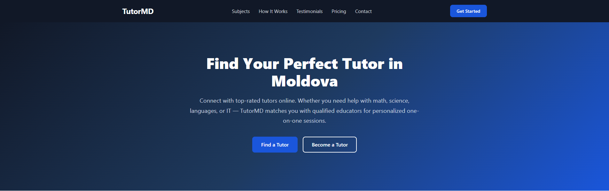
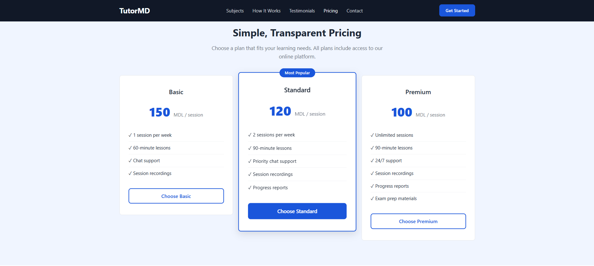
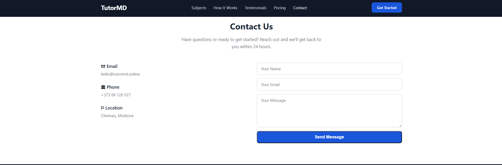

# TutorMD - Online Tutoring in Moldova

A landing page for **TutorMD** — an online tutoring platform connecting students in Moldova with qualified tutors across a wide range of subjects including Mathematics, Physics, Chemistry, Languages, IT & Programming, and History.

The page features a sticky navigation bar, hero section with call-to-action buttons, subject cards grid, a step-by-step "How It Works" section, student testimonials, transparent pricing tiers, a contact form, and a responsive mobile menu — all built with vanilla HTML and CSS.

## Live Demo

[https://home.tutormd.online](https://home.tutormd.online)

## Screenshots

## Tech Stack

- HTML5
- CSS3 (Flexbox, Grid, custom properties)
- No JavaScript frameworks or CSS libraries
