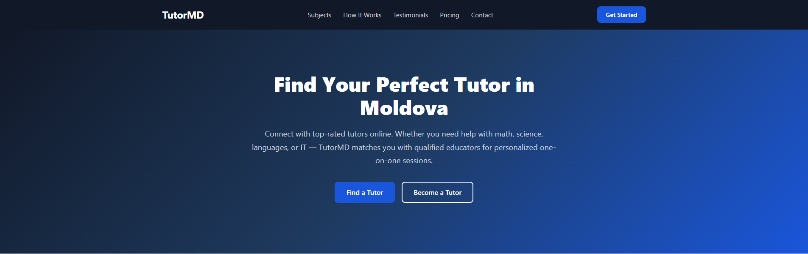
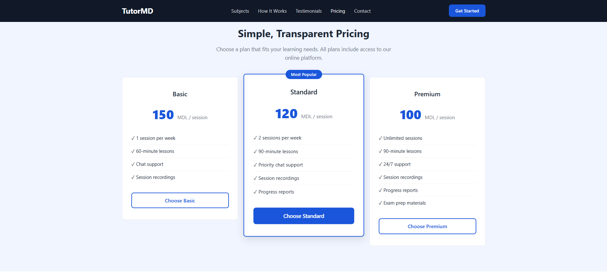
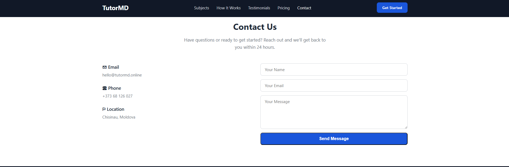

# TutorMD - Online Tutoring in Moldova

A landing page for **TutorMD** — an online tutoring platform connecting students in Moldova with qualified tutors across a wide range of subjects including Mathematics, Physics, Chemistry, Languages, IT & Programming, and History.

## Live Demo

[https://home.tutormd.online](https://home.tutormd.online)

## CMS

Content is managed via Decap CMS at [https://home.tutormd.online/admin](https://home.tutormd.online/admin). Editors can update subjects, testimonials, pricing plans, and site-wide settings through a Git-based workflow — no code changes needed.

## Tech Stack

- [Astro](https://astro.build) — Static Site Generator
- [TailwindCSS](https://tailwindcss.com) — via CDN with `preflight: false`
- [Decap CMS](https://decapcms.org) — Git-based headless CMS
- GitHub Actions — automated build and deploy to GitHub Pages

## Project Structure

```
src/
  content/
    subjects/       # Markdown files for each subject card
    testimonials/   # Markdown files for each testimonial
    pricing/        # JSON files for each pricing plan
  data/
    site.json       # Hero, stats, contact, footer copy
  components/       # Astro components (Nav, Hero, Subjects, etc.)
  layouts/
    BaseLayout.astro
  pages/
    index.astro
public/
  admin/
    index.html      # Decap CMS entry point
    config.yml      # CMS collections config
  reset.css
  style.css
  owl.svg
  CNAME
```

## Dev Commands

```bash
npm install       # install dependencies
npm run dev       # start dev server at localhost:4321
npm run build     # build to dist/
npm run preview   # preview production build locally
```

## Screenshots






